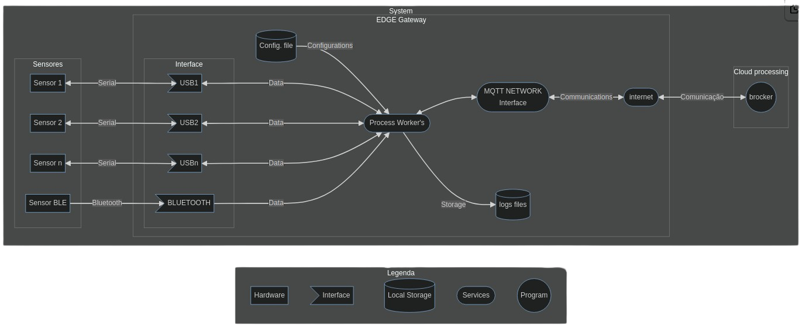

# 🐍 EDGE computing for gateway devices MQTT for testes, productions and debugging embedded systems and outhers
  
Like ESP WIFI modules, microcontrollers, Linux serial console etc.

With this program it's possible to save logs from different serial ports just by [configuring the JSON file](#-configuring) (`config.json`), the number of ports and unlimited and each process for processing and saving the logs is with you on separate instances and threads.



## Setup config file

To find the tty port associated with your microcontroller using the `ls /dev/serial/by-path` command, follow these steps:

1. Connect your microcontroller to the computer via the serial port;
2. Open a terminal and execute the command `ls /dev/serial/by-path` to list the available serial devices;
3. Look at the list to identify the device associated with your microcontroller. Typically, the name of the symbolic link includes information about the manufacturer or model of the device;
4. Fill in the serialid parameter of the devices in the [`config.json`](config.json) file with the following path: `/dev/serial/by-path/<id-returned-by-previous-command>`

> By using this path to access the serial device instead of the port number (e.g., `/dev/ttyACM0`), the operating system will always point to the correct device, regardless of how many times the microcontroller is disconnected and reconnected.

| Interface          | Description                                                       | Configuration Example                                                   | Communication Directions | Implementations Status  |
|--------------------|-------------------------------------------------------------------|-------------------------------------------------------------------------|-------------------------|-------------------------|
| Serial-to-File     | Serial communication interface for saving data locally.            | ```json { "serialport": "...", "baudrate": 115200, "timeout": 5, ... }``` | Unidirecional          | Implemented             |
| Serial-to-MQTT     | Converts serial data to MQTT messages. **MQTT setup is mandatory.**| ```json { "server_mqtt": { "username": "...", "password": "...", "server": "...", "port": 1883, "subscribe-upstream": "...", "subscribe-downstream": "..." } }``` | Bidirecional            | Implemented             |
| Bluetooth-GPS      | Connects GPS devices via Bluetooth.                                | ```json { "address": "...", "port": 1, "samplingSeconds": 1, ... }```     | Unidirecional          | Implemented             |
| Bluetooth-BLE      | Connects BLE devices via Bluetooth Low Energy.                     | ```json { "address": "...", "port": 1, "samplingSeconds": 1, ... }```     | Unidirecional          | Implemented                 |
| Others             | Unspecified interfaces causing exceptions for invalid devices.      | No specific configuration example provided.                               | Unidirecional          | Implemented             |

Using file `config.json` for configuration for one or multiple serial ports: 
 
Example multiples interfaces and serial ports: 
```json
{
  "server_mqtt": {
    "username": "username",
    "password": "password",
    "server": "url",
    "port": 1883,
    "subscribe-upstream": "topic/to/send/data",
    "subscribe-downstream": "topic/to/receive/data"
  },
  "devices": [
    {
      "serialport": "/dev/serial/by-path/pci-0000:00:14.0-usb-0:2:1.0",
      "baudrate": 115200,
      "timeout": 5,
      "description": "Arduino",
      "interface": "serial-to-file"
    },
    {
      "serialport": "/dev/serial/by-path/pci-0000:00:14.0-usb-0:1:1.0-port0",
      "baudrate": 115200,
      "timeout": 5,
      "description": "NodeMCU",
      "interface": "serial-to-file"
    },
    {
      "address": "54:43:B2:8A:11:26",
      "port": 1,
      "samplingSeconds": 1,
      "description": "AGP",
      "interface": "bluetooth-gps"
    },
    {
      "address": "E8:31:CD:5C:AC:B2",
      "port": 1,
      "samplingSeconds": 1,
      "description": "DBG",
      "interface": "bluetooth-gps"
    },
    {
      "address": "E8:31:CD:5C:AC:B2",
      "port": 1,
      "samplingSeconds": 1,
      "description": "Logs from BLE",
      "interface": "bluetooth-BLE"
    },
    {
      "serialport": "/dev/serial/by-id/usb-Silicon_Labs_CP2104_USB_to_UART_Bridge_Controller_01B970A5-if00-port0",
      "baudrate": 115200,
      "timeout": 5,
      "description": "Emulate-payload",
      "interface": "serial-to-mqtt"
    }
  ]
}
```

> Note: To commit a new [config.json](config.json) file as example execute: `git update-index --no-assume-unchanged config.json`, commit changes and execute again: `git update-index --assume-unchanged config.json`

> Note: The capacity of the data logger depends only on the CPU and disk IO speeds! 


## 🚀 Run the application

Create a virtual environment to isolate our package dependencies locally (first run time)
```bash
python3 -m venv env
```

```bash
source env/bin/activate
```

On Windows use:
```bash 
`env\Scripts\activate`
```

Install dependencies:

```bash
pip install -r requirements.txt
```

To run the application, simply execute:
```bash
python src/main.py
```

## 💻 Install as a service
To install the app as a service, just run:
```bash
cd services && sudo chmod +x install.sh && sudo ./install.sh
```

Verify service in realtime

```bash
journalctl -u datalogger.service -f
```
or last logs

```bash
journalctl --unit=datalogger.service -n 100 --no-pager
```

Uninstalling 

```bash
sudo ./uninstall.sh
```

***

##  👷 Development

Install pre-commit for automatic code verifications

```bash 
pip install pre-commit
```

```bash 
pre-commit --version
```

```bash 
pre-commit run --all-files
```

Install the git hook scripts

```bash 
pre-commit install
```

***
## 🧪 Testing

If you're looking to run a program to send data via serial to your microcontroller, check out the [`example/arduino`](example/arduino) directory in this repository. You'll find a simple **PlatformIO** project that provides tests for sending data over serial communication with an Arduino microcontroller. Simply navigate to the [`example/arduino`](example/arduino) directory in this repository and run the project with **PlatformIO** to get started.

***
## Troubleshooting

If you are not running "pybluez", install the following dependencies:

```bash 
sudo apt-get install bluetooth libbluetooth-dev
```
For scan bluetooth devices:

```bash 
bluetoothctl
```

