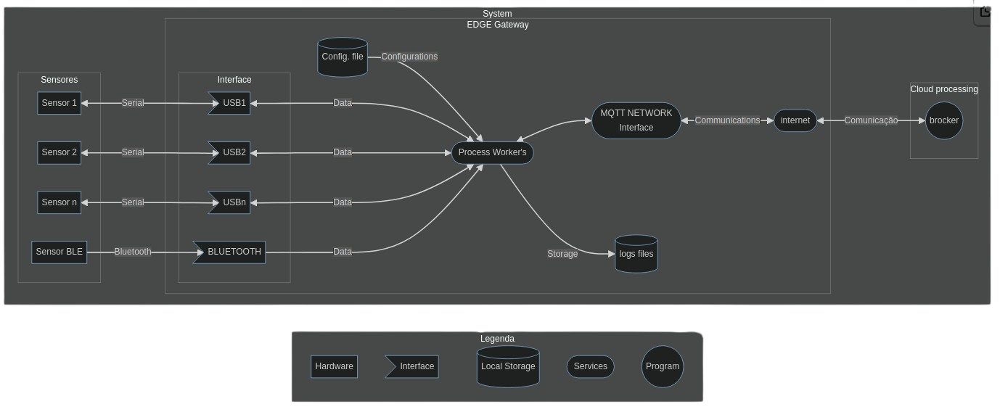

# EdgeGateway

**EdgeGateway** is a Python-based telemetry gateway designed to collect data from embedded devices, field sensors, and local communication interfaces, standardize telemetry messages, and forward them to an MQTT broker or local log files.

The project is intended for IoT deployments, instrumentation, firmware testing, industrial telemetry, field data acquisition, and debugging of devices connected through **Serial**, **Bluetooth**, **BLE**, and **MQTT**.



---

## Overview

EdgeGateway acts as an edge layer between physical devices and supervision systems, databases, dashboards, or IoT platforms.

Multiple devices can be configured in a single `config.json` file. For each device, the gateway creates an independent interface instance running in a separate thread, allowing parallel data collection from several serial ports, BLE devices, or Bluetooth GPS modules.

Main telemetry flow:

```text
Sensor / MCU / Device
        |
        | Serial, BLE, or Bluetooth
        v
EdgeGateway
        |
        | Validated JSON + gateway metadata
        v
MQTT Broker / File Server / IoT Platform
        |
        v
Dashboards, databases, alarms, and integrations
```

---

## Project purpose

The main goal of EdgeGateway is to simplify telemetry collection from embedded devices without requiring every firmware to implement a complete cloud communication stack.

With EdgeGateway, it is possible to:

- Read serial data from microcontrollers such as ESP32, Arduino, STM32, Raspberry Pi Pico, or industrial modules.
- Convert serial JSON messages into MQTT publications.
- Receive BLE telemetry and publish it to MQTT.
- Store local CSV logs for validation, testing, and offline auditing.
- Collect GPS data through Bluetooth.
- Forward MQTT commands back to the connected device.
- Add gateway-side metadata, such as reception timestamp.
- Run as a Linux service in field installations.

---

## Telemetry-focused use cases

### IoT telemetry

EdgeGateway can collect environmental, industrial, and field telemetry, including:

- Temperature
- Humidity
- Pressure
- CO2
- VOC
- Rainfall
- Pulse counters
- GPS position
- Device status
- Custom sensor payloads
- Signal quality indicators such as RSSI and SNR

### Serial-to-MQTT gateway

A device sends JSON through a serial port and EdgeGateway automatically publishes it to the configured MQTT broker.

Example serial input:

```json
{
  "serial": "123456789",
  "message": "SENSOR_DATA",
  "temperature": 24.6,
  "humidity": 71.2,
  "pressure": 101325
}
```

Example MQTT payload published by the gateway:

```json
{
  "gateway_meta": {
    "timestamp": "2026-05-05 17:30:22.410120"
  },
  "data": {
    "serial": "123456789",
    "message": "SENSOR_DATA",
    "temperature": 24.6,
    "humidity": 71.2,
    "pressure": 101325
  }
}
```

### BLE-to-MQTT gateway

A BLE device sends notifications containing JSON. EdgeGateway validates the message, adds gateway metadata, and publishes the data to the configured MQTT topic.

### Local datalogger

The `serial-to-file` interface stores received data in CSV files, organized by device. This is useful for bench testing, field validation, audit trails, and offline data collection.

### Continuous field operation

The project can be installed as a Linux `systemd` service, allowing continuous operation on a Raspberry Pi, industrial gateway, mini PC, or local server.

---

## Supported interfaces

| Interface | Purpose | Direction | Status |
|---|---|---:|---|
| `serial-to-file` | Reads data from a serial port and stores it locally | Input | Implemented |
| `serial-to-mqtt` | Reads serial JSON, adds metadata, and publishes to MQTT | Bidirectional | Implemented |
| `bluetooth-gps` | Reads Bluetooth GPS NMEA data and stores it locally | Input | Implemented |
| `bluetooth-BLE` | Reads BLE notifications and displays received data | Input | Implemented |
| `bluetooth-BLE-to-mqtt` | Reads JSON over BLE, adds metadata, and publishes to MQTT | Bidirectional | Implemented |

---

## Project structure

```text
EdgeGateway-development/
├── README.md
├── requirements.txt
├── config.json
├── src/
│   ├── main.py
│   ├── power-fail.py
│   ├── Utils.py
│   ├── interface/
│   │   ├── SerialToFile.py
│   │   ├── SerialToMQTT.py
│   │   ├── BLEConnector.py
│   │   ├── BLEConnectorToMQTT.py
│   │   ├── BluetoothGpsAgrinavi.py
│   │   └── mqtt_manager.py
│   └── storage/
│       └── Dataanalysis.py
├── services/
│   ├── datalogger.service
│   ├── install.sh
│   └── uninstall.sh
├── examples/
└── diagram/
```

---

## Telemetry format

When the destination is MQTT, devices are expected to send JSON messages.

The gateway performs a basic validation to ensure that the incoming payload is valid JSON. After validation, the original device payload is wrapped inside the `data` field, while gateway-generated metadata is added to `gateway_meta`.

Published format:

```json
{
  "gateway_meta": {
    "timestamp": "YYYY-MM-DD HH:MM:SS"
  },
  "data": {
    "serial": "device_serial",
    "message": "message_type",
    "payload": {}
  }
}
```

This structure makes the telemetry easier to consume by:

- Node-RED
- Home Assistant
- Grafana
- Telegraf
- InfluxDB
- ClickHouse
- MongoDB
- Telemetry APIs
- Alarm services
- AI and analytics pipelines

---

## Configuration example

Create a `config.json` file in the project root.

```json
{
  "server_mqtt": {
    "username": "mqtt_user",
    "password": "mqtt_password",
    "server": "broker.example.com",
    "port": 1883,
    "subscribe-upstream": "telemetry/gateway/upstream",
    "subscribe-downstream": "telemetry/gateway/downstream"
  },
  "devices": [
    {
      "serialport": "/dev/serial/by-path/pci-0000:00:14.0-usb-0:2:1.0",
      "baudrate": 115200,
      "timeout": 5,
      "description": "ESP32 Environmental Station",
      "interface": "serial-to-mqtt"
    },
    {
      "serialport": "/dev/serial/by-id/usb-Silicon_Labs_CP2104_USB_to_UART_Bridge_Controller-if00-port0",
      "baudrate": 115200,
      "timeout": 5,
      "description": "STM32 Pulse Counter",
      "interface": "serial-to-file"
    },
    {
      "address": "44:17:93:60:33:22",
      "samplingSeconds": 0.05,
      "description": "BLE Telemetry Node",
      "interface": "bluetooth-BLE-to-mqtt"
    },
    {
      "address": "54:43:B2:8A:11:26",
      "port": 1,
      "samplingSeconds": 1,
      "description": "Bluetooth GPS",
      "interface": "bluetooth-gps"
    }
  ]
}
```

---

## Stable serial port configuration on Linux

Avoid using `/dev/ttyUSB0` or `/dev/ttyACM0` directly because these names can change after a reconnect or reboot.

Use:

```bash
ls /dev/serial/by-path
```

or:

```bash
ls /dev/serial/by-id
```

Then configure the full path in the `serialport` field of `config.json`.

Example:

```json
{
  "serialport": "/dev/serial/by-id/usb-Silicon_Labs_CP2104_USB_to_UART_Bridge_Controller-if00-port0",
  "baudrate": 115200,
  "timeout": 5,
  "description": "Production Gateway",
  "interface": "serial-to-mqtt"
}
```

---

## Installation

Create a virtual environment:

```bash
python3 -m venv env
source env/bin/activate
```

On Windows:

```bash
env\\Scripts\\activate
```

Install the dependencies:

```bash
pip install -r requirements.txt
```

Linux Bluetooth dependencies:

```bash
sudo apt-get update
sudo apt-get install -y bluetooth libbluetooth-dev
```

---

## Running the gateway

Run the application:

```bash
python src/main.py
```

The application will:

1. Load the `config.json` file.
2. Initialize each configured device.
3. Open Serial, Bluetooth, or BLE connections.
4. Publish valid telemetry to MQTT or save it to files.
5. Keep the process running with periodic keep-alive messages.

---

## Installing as a Linux service

To install EdgeGateway as a `systemd` service:

```bash
cd services
sudo chmod +x install.sh
sudo ./install.sh
```

View real-time logs:

```bash
journalctl -u datalogger.service -f
```

View the latest messages:

```bash
journalctl --unit=datalogger.service -n 100 --no-pager
```

Remove the service:

```bash
cd services
sudo ./uninstall.sh
```

---

## MQTT topics

The project uses two main MQTT topics:

| Field | Description |
|---|---|
| `subscribe-upstream` | Topic where the gateway publishes telemetry received from devices |
| `subscribe-downstream` | Topic where the gateway listens for commands coming from the platform |

Example:

```json
{
  "subscribe-upstream": "telemetry/edgegateway/data",
  "subscribe-downstream": "telemetry/edgegateway/commands"
}
```

### Telemetry publication

```text
Device -> EdgeGateway -> MQTT upstream
```

### Command delivery

```text
Cloud / Node-RED / API -> MQTT downstream -> EdgeGateway -> Device
```

---

## Dashboard and database integration

EdgeGateway can be used as an edge data collector for pipelines such as:

```text
EdgeGateway -> MQTT -> Node-RED -> InfluxDB -> Grafana
EdgeGateway -> MQTT -> Telegraf -> InfluxDB -> Grafana
EdgeGateway -> MQTT -> Python API -> ClickHouse -> Grafana
EdgeGateway -> MQTT -> MongoDB -> Analytics
EdgeGateway -> MQTT -> Home Assistant
```

This architecture separates physical data acquisition from storage, visualization, alarms, and analytics.

---

## Multi-channel pulse telemetry

For devices that send multiple pulse counter channels, keep the physical channel identification inside each pulse item.

Example:

```json
{
  "product": 1,
  "protocol": "0.4.2",
  "firmware": "1.0.8-dev",
  "serial": "123456789",
  "message": "PULSE_SENSOR",
  "Pulses": [
    { "Sensor": 1, "lsb": 10, "msb": 0 },
    { "Sensor": 2, "lsb": 25, "msb": 0 },
    { "Sensor": 3, "lsb": 4, "msb": 1 }
  ],
  "radio_rssi": -78,
  "radio_snr": 7.5
}
```

In this case, each object inside `Pulses` represents an independent measurement channel. The application consuming MQTT should store each pulse record using a composite key such as:

```text
serial + sensor_channel + timestamp
```

Recommended database fields:

| Field | Description |
|---|---|
| `serial` | Device identifier |
| `sensor_channel` | Physical pulse counter channel |
| `pulse_value` | Calculated value from `lsb` and `msb` |
| `radio_rssi` | Device signal strength |
| `radio_snr` | Signal-to-noise ratio |
| `firmware` | Firmware version |
| `protocol` | Protocol version |
| `gateway_timestamp` | Timestamp generated by the gateway when the message was received |

### Pulse value calculation

When the firmware sends pulse counters using `lsb` and `msb`, the recommended normalized value is:

```text
pulse_value = lsb + (msb * 256)
```

This allows each pulse channel to be stored as an independent telemetry sample while preserving the device serial number and channel number.

---

## Signal quality telemetry

When available, signal metrics should be stored together with each device sample:

| Field | Meaning |
|---|---|
| `radio_rssi` | Received signal strength indicator. Usually expressed in dBm. More negative values indicate weaker signal. |
| `radio_snr` | Signal-to-noise ratio. Higher values usually indicate a cleaner radio link. |
| `radio_channel` | Radio channel used by the uplink, when available. |
| `gateway_id` | Identifier of the gateway that received the radio packet. |
| `radio_tmst` | Radio timestamp, when provided by the network server. |

These fields are useful for diagnosing coverage issues, antenna positioning, packet loss, gateway performance, and device installation quality.

---

## Development

Install pre-commit:

```bash
pip install pre-commit
pre-commit install
```

Run all checks:

```bash
pre-commit run --all-files
```

---

## Testing

The `examples/` directory contains example projects for sending data through Serial and BLE.

To test with PlatformIO:

```bash
cd examples/arduino
pio run -t upload
```

Then run the gateway and monitor the MQTT broker:

```bash
mosquitto_sub -h broker.example.com -p 1883 -t "telemetry/#" -v
```

---

## Troubleshooting

### Serial port permission

Add the user to the `dialout` group:

```bash
sudo usermod -a -G dialout $USER
```

Log out and log back in after running this command.

### Check serial devices

```bash
dmesg | grep tty
ls /dev/serial/by-id
ls /dev/serial/by-path
```

### Check Bluetooth

```bash
bluetoothctl
scan on
```

### Check the service

```bash
systemctl status datalogger.service
journalctl -u datalogger.service -f
```

---

## Security recommendations

- Do not commit real credentials in `config.json`.
- Use MQTT users with topic-level restricted permissions.
- Prefer TLS in production when the broker is exposed to the internet.
- Keep dependencies updated.
- Run the service with a limited Linux user instead of root whenever possible.

---

## Suggested roadmap

- Optional normalization of multi-channel pulse payloads.
- Native support for RSSI/SNR as telemetry metadata.
- BLE reconnection with configurable backoff.
- Environment-variable configuration for Docker and Kubernetes.
- Direct exporter for InfluxDB or ClickHouse.
- Internal gateway metrics, such as uptime, messages per minute, and connection failures.
- Automated tests for telemetry parsers.

---

## License

See the [`LICENSE`](LICENSE) file.
